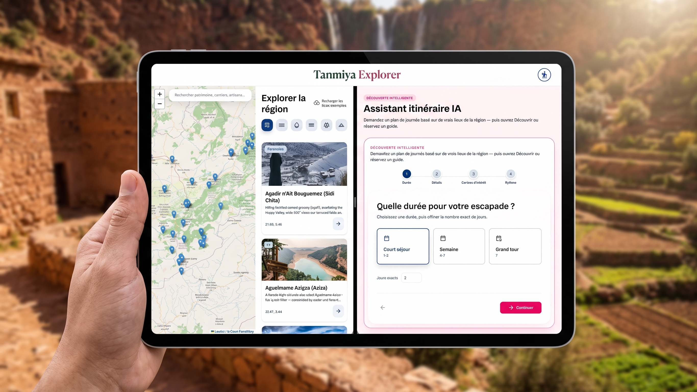

# Tanmiya Explorer

Smart tourism platform for the **Béni Mellal–Khénifra** region of Morocco. Tourists explore points of interest on a map, generate AI itineraries, book guide-led trip programs, and contact local artisans. Guides publish multi-day programs and manage bookings.

Built as a **$0** hackathon prototype (Firebase Spark + Gemini free tier).


## Tech stack

| Layer | Choice |
|-------|--------|
| Frontend | React + Vite |
| Routing | React Router |
| Map | Leaflet.js + OpenStreetMap |
| Backend / Auth / DB | Firebase Authentication + Cloud Firestore |
| AI itineraries | Google Gemini (AI Studio API key) |
| 360° preview | Pannellum (one flagship POI) |
| Hosting | Firebase Hosting (free tier) |

## Features

- Interactive POI map with category filters
- AI itinerary assistant (duration, interests, pace) + route on map + Google/Apple/Waze deep links
- Persistent AI chat history and a 7-day device-local planner draft that survives place navigation
- Place activities, linked intangible heritage, and a private tourist badge passport
- Guide dashboard: create trip programs, confirm/cancel bookings
- Tourist booking flow (simulated payment — status `pending`)
- Artisan marketplace with product photos, in-app orders, options, and WhatsApp contact
- English, French, and Arabic UI with RTL
- 360° preview on Cascades d’Ouzoud (`/poi/ouzoud`)

## Project Structure

```
Tadla/
├── src/
│   ├── components/     # UI components (incl. promo/)
│   ├── pages/           # Route-level views
│   ├── context/         # React context (auth, app state)
│   ├── services/        # Firebase + Gemini API integrations
│   ├── data/            # Static/seed data (POIs, categories)
│   ├── i18n/             # EN / FR / AR translations (RTL support)
│   ├── utils/
│   └── assets/
├── public/
│   └── panorama/         # 360° equirectangular images (Pannellum)
├── firestore.rules       # Firestore security rules
├── firebase.json         # Firebase Hosting/Firestore config
└── .env.example
```

## Setup (local)

1. **Node.js 18+** and npm
2. Clone / open this folder, then:

```bash
npm install
cp .env.example .env
```

3. Fill `.env` (never commit real keys):

| Variable | Where to get it |
|----------|-----------------|
| `VITE_FIREBASE_*` | Firebase Console → Project settings → Your apps → Web config |
| `VITE_GEMINI_API_KEY` | [Google AI Studio](https://aistudio.google.com/apikey) |
| `VITE_GEMINI_MODEL` | Optional (default `gemini-2.5-flash`) |

4. In Firebase Console:
   - Enable **Authentication** → Email/Password (and Google if used)
   - Create **Firestore**
   - Deploy rules: `npx firebase deploy --only firestore:rules` (see `firestore.rules` — auth-required writes; no anonymous open write)
5. Run:

```bash
npm run dev
```

Open the URL Vite prints (usually http://localhost:5173).

6. First visit:
   - **Sign in** (tour accounts only)
   - **Map** → Seed sample POIs if empty (must be signed in)
   - **Artisans** → Seed demo artisans if empty
   - **Partner with us** → apply as guide/artisan; promote yourself to `admin` in Firestore `users/{uid}.role` to approve applications
   - After approval, open **Guide desk** / **Workshop** from the account menu

## Deploy (Firebase Hosting)

```bash
npm install
npm run build
npx firebase login
npx firebase deploy --only hosting
npx firebase deploy --only firestore:rules
```

Vite bakes `VITE_*` values into the build at **build time**. Re-run `npm run build` after changing `.env`, then deploy again.

For CI or another machine, export the same `VITE_*` env vars before `npm run build`.

## Firestore data model

- `users` — `{ id, name, email, role }` (`tourist` \| `guide` \| `artisan` \| `admin`) — public signup is always `tourist`
- `partnerApplications` — eligibility requests; admin sets role on approve
- `pois` — sites with `lat` / `lng`, category, images
- `tripPrograms` — guide itineraries, price, available dates
- `bookings` — `{ tripProgramId, touristId, date, numPeople, status }` (cancel own; capacity shared per date)
- `artisanListings` — craft, village, WhatsApp, `products[]`
- `savedItineraries` — AI plans + optional `requestQuote`
- `reviews` — 1–5 stars on trips / artisans

## Known limitations

- **Payments are simulated** — bookings stay `pending` until a guide confirms; no Stripe/PayPal
- **Booking capacity is not transactional** — move the final capacity check/write to a transaction or trusted server before production
- **Firestore rules** protect catalog ownership and roles, but production rules still need field-level validation and emulator tests
- **Spark free-tier quotas** — daily read/write limits; fine for demos, not heavy traffic
- **Gemini key in the browser** (`VITE_`) — acceptable for a prototype; prefer a Cloud Function proxy for production
- **Chat, planner draft, and badges are device-local** — authenticated cross-device sync is not implemented
- **Partner media uses URLs/sample assets** — production uploads need Firebase Storage, validation, compression, and moderation
- **No application test suite or CI workflow** — add automated coverage before a public pilot
- **360° image** — replace `public/panorama/flagship-360.jpg` with a real equirectangular shot of the flagship site
- **Waze** deep links support a single destination (first stop), not full multi-stop routes
- **Map tiles** need network; use **Print / PDF** on Plan for an offline day sheet

## Scripts

| Command | Purpose |
|---------|---------|
| `npm run dev` | Local development |
| `npm run build` | Production build → `dist/` |
| `npm run preview` | Preview the production build locally |
| `npx firebase deploy --only hosting` | Deploy `dist/` to Firebase Hosting |
